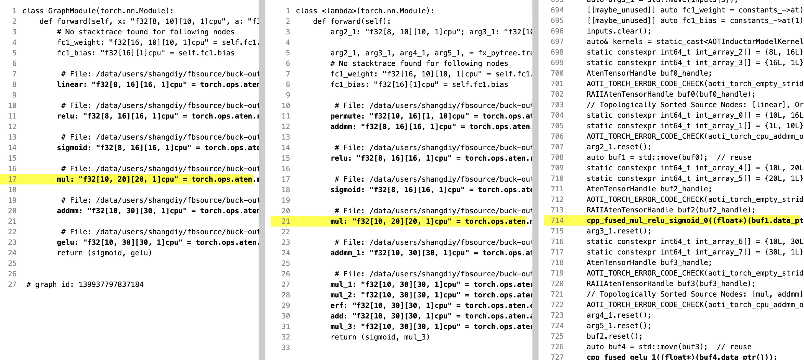

# FrankenTorch

  

FrankenTorch is a clean-room Rust reimplementation targeting grand-scope excellence: semantic fidelity, mathematical rigor, operational safety, and profile-proven performance.

## What Makes This Project Special

Deterministic Autograd Contract (DAC): replayable gradient graph execution with provenance-complete gradient evidence.

This is treated as a core identity constraint, not a best-effort nice-to-have.

## Methodological DNA

This project uses four pervasive disciplines:

1. alien-artifact-coding for decision theory, confidence calibration, and explainability.
2. extreme-software-optimization for profile-first, proof-backed performance work.
3. RaptorQ-everywhere for self-healing durability of long-lived artifacts and state.
4. frankenlibc/frankenfs compatibility-security thinking: strict vs hardened mode separation, fail-closed compatibility gates, and explicit drift ledgers.

## Current State

- project charter docs established
- legacy oracle cloned:
  - /dp/frankentorch/legacy_pytorch_code/pytorch

## V1 Scope

- tensor storage/view/index semantics; - core op families with backward rules; - minimal nn and optimizer workflows; - checkpoint scope.

## Architecture Direction

tensor API -> dispatcher -> device kernels -> autograd engine -> nn and optimizer stack

## Compatibility and Security Stance

Preserve PyTorch-observable tensor semantics, autograd contracts, and scoped optimizer behaviors.

Protect against gradient corruption, unsafe in-place mutation paths, and serialization mismatch or replay inconsistencies.

## Performance and Correctness Bar

Track step-time tails, backward overhead, kernel throughput, and memory churn under representative training traces.

Maintain deterministic gradient accumulation, alias/versioning rules, and backward-equivalence invariants.

## Key Documents

- AGENTS.md
- COMPREHENSIVE_SPEC_FOR_FRANKENTORCH_V1.md

## Next Steps

1. Scaffold Cargo workspace and crate map.
2. Implement first end-to-end V1 vertical slice.
3. Establish differential conformance harness vs legacy oracle.
4. Record baseline benchmarks and wire regression gates.
5. Add RaptorQ sidecar durability for persistent evidence artifacts.

## Porting Artifact Set

- PLAN_TO_PORT_PYTORCH_TO_RUST.md
- EXISTING_PYTORCH_STRUCTURE.md
- PROPOSED_ARCHITECTURE.md
- FEATURE_PARITY.md

These four docs are now the canonical porting-to-rust workflow for this repo.
